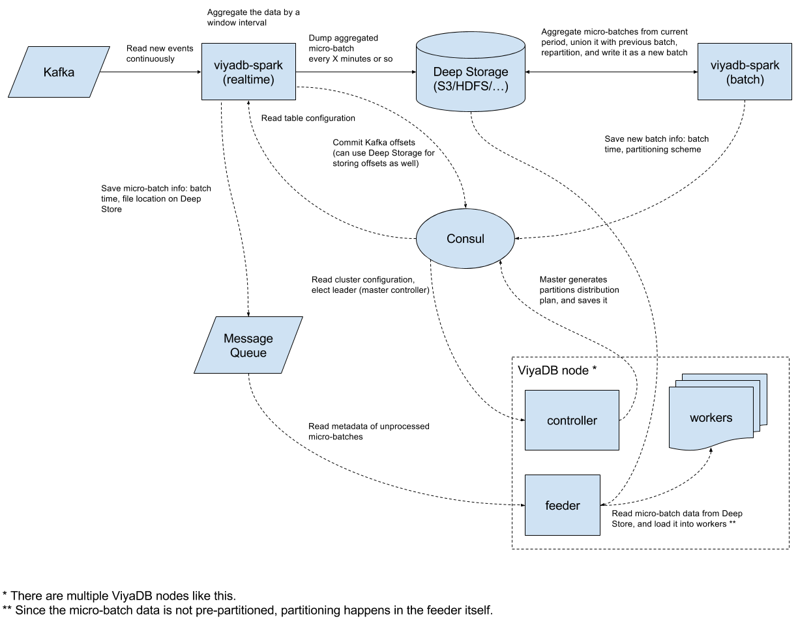

Clustering
===========

ViyaDB implements shared nothing architecture, which means that workers hold partitions
of data independently from each other. This allows for many possible implementations of
clustering depending on business requirements and/or restrictions you might have.

Below is one of possible implementations of clustered ViyaDB environment.

## Diagram



## Components

Let's describe all the components of this particular clustering implementation, and how they help
gather insights off of hundreds of thousands of events per second in real-time.

### Consul

Consul or technologies alike are irreplaceable in any distributed application, where different
components need agree on something. In our case, Consul will be used for two things:

 * Central configuration storage
 * Coordination of ViyaDB cluster nodes

The quickest way to setup Consul is using Docker:

```bash
docker run --rm -ti --name viyadb-consul -p 8500:8500 consul
```

### Kafka

Kafka is a de facto standard messaging systeam in the industry for delivering events, thus it was
chosen as the first supported data source. We leverage Kafka also for storing and exchanging various 
metadata between different components.

If you don't have any Kafka, please start one using [Kafka Quickstart](https://kafka.apache.org/quickstart) documentation.

### Deep Store

Deep Store is a place on some kind of distributed file system or object store for keeping Indexer results.
In fact, the copy of all the data is always stored there, which facilitates data repair and data recovery.

!!! note "File systems support"
    For now, only POSIX-compilant file systems and Amazon S3 are supported.

### Indexer

This component consists of two sub-components:

 * Real-time processor
 * Batch processor

The first component represents Spark Streaming based application whose task is to read events
from Kafka, and pre-aggregate them into micro-batches for loading into ViyaDB.
The second part is invoked periodically, and it aims at compacting previous micro-batches
and creating the best data partitioning plan.

Spark cluster is required for running the Indexer at high scale. For testing purposes it's enough to just download
and extract latest [Apache Spark](https://spark.apache.org/downloads.html) package.

To read more about the Indexer, please refer to the [README](https://github.com/viyadb/viyadb-spark) file
of the project.

### ViyaDB

This is the database cluster itself. Every physical node of the cluster consists of supervisor process,
which spawns worker processes by the number of available CPU. Node controller running on every node
deals with loading data into worker processes. In addition, controller also redirects database queries to 
a worker node containing required data partition, based on query filter (or queries needed workers,
and aggregates results).

## Configuration

### Table configuration

This configuration defines database table structure, what event fields represent dimensions,
and which ones are metrics. See [Creating Tables](usage.md#creating-tables) section for more
on table configuration.

```json
{
  "name": "events",
  "dimensions": [
    {"name": "app_id"},
    {"name": "user_id", "type": "uint"},
    {
      "name": "event_time", "type": "time",
      "format": "millis", "granularity": "day"
    },
    {"name": "country"},
    {"name": "city"},
    {"name": "device_type"},
    {"name": "device_vendor"},
    {"name": "ad_network"},
    {"name": "campaign"},
    {"name": "site_id"},
    {"name": "event_type"},
    {"name": "event_name"},
    {"name": "organic", "cardinality": 2},
    {"name": "days_from_install", "type": "ushort"}
  ],
  "metrics": [
    {"name": "revenue" , "type": "double_sum"},
    {"name": "users", "type": "bitset", "field": "user_id", "max": 4294967295},
    {"name": "count" , "type": "count"}
  ]
}
```

To load this configuration into Consul, store this JSON in file `table.json`, and run:

```bash
curl --request PUT --data @table.json \
  http://<consul-host>:8500/v1/kv/viyadb/tables/events/config
```

### Indexer configuration

The following section tells Indexer where to read data from, what's the data format
(supported formats are: JSON, CSV), what are micro-batch and big batch window sizes, etc.

```json
{
  "tables":[
    "events"
  ],
  "deepStorePath":"s3://viyadb-deepstore",
  "realTime":{
    "windowDuration":"PT15S",
    "kafkaSource":{
      "topics":[
        "events"
      ],
      "brokers":[
        "kafka-host:9092"
      ]
    },
    "parseSpec":{
      "format":"json",
      "timeColumn":{
        "name":"event_time"
      }
    },
    "notifier":{
      "type":"kafka",
      "channel":"kafka-host:9092",
      "queue":"rt-notifications"
    }
  },
  "batch":{
    "partitioning":{
      "columns":[
        "app_id"
      ],
      "partitions":16
    },
    "notifier":{
      "type":"kafka",
      "channel":"kafka-host:9092",
      "queue":"batch-notifications"
    }
  }
}
```

Replace `kafka-host:9090` with comma separated list of your actual Kafka brokers.
To load this configuration into Consul, store this JSON in file `indexer.json`, and run:

```bash
curl --request PUT --data @indexer.json \
  http://<consul-host>:8500/v1/kv/viyadb/indexers/main/config
```

### Cluster configuration

This configuration tells ViyaDB controller what tables to create, and which indexers to pull
the data from.

```json
{
  "replication_factor": 2,
  "workers": 32,
  "tables": ["events"],
  "indexers": ["main"]
}
```

Currently, the number of expected workers must be set explicitly in cluster configuration.
This is the total number of nodes multiplied by the number of CPU cores on each machine.
Using this configuration, two copies of a single partition will be placed on two different workers.

To load this configuration into Consul, store this JSON in file `cluster.json`, and run:

```bash
curl --request PUT --data @cluster.json \
  http://<consul-host>:8500/v1/kv/viyadb/clusters/cluster001/config
```

## Starting components

### Mobile user activity simulator

Let's run a simulator, which will inject some synthetic data representing mobile app
user activity into Kafka:

```bash
docker run --log-driver=none --rm -ti viyadb/events-generator:latest | \
  kafka-console-producer.sh --broker-list <kafka-host>:9092 \
  --topic events >/dev/null
```

### Indexer process

Once the configuration part is done, we can start the Indexer process. The following
command is tuned for running Indexer in a limited Spark local mode environment,
please tune it according to your Spark cluster capacity and events rate.

```bash
wget -q \
  https://github.com/viyadb/viyadb-spark/releases/download/v0.0.2/viyadb-spark_2.11-0.0.2-uberjar.jar

spark-submit --executor-memory 2G \
  --conf spark.streaming.kafka.maxRatePerPartition=10000 \
  --conf spark.sql.shuffle.partitions=1 \
  --class com.github.viyadb.spark.streaming.Job \
  viyadb-spark_2.11-0.0.2-uberjar.jar \
  --indexer-id "main"
```

### Database cluster

Now it's the time to start ViyaDB cluster. Repeat the following procedure for every
node (we'll start 4 nodes):

```bash
mkdir /tmp/viyadb
cat >/tmp/viyadb/conf.json <<EOF
{
  "supervise": true,
  "workers": 8,
  "cluster_id": "cluster001",
  "consul_url": "http://consul-host:8500",
  "state_dir": "/var/lib/viyadb"
}
EOF

docker run --rm -ti \
  -p 5000-5007:5000-5007 \
  -p 5555:5555 \
  -v /tmp/viyadb:/var/lib/viyadb:rw \
  viyadb/viyadb:latest \
  /opt/viyadb/bin/viyad /var/lib/viyadb/conf.json
```

## Querying

Once all components are started and running, we can start sending some queries.

Multiple options to query ViyaDB exist, such as [REST API](usage.md#querying)
or [Zeppelin](https://github.com/viyadb/zeppelin-interpreter) interpreter,
but we'll just use SQL shell for this test.

Start the shell, and provide it with a hostname of one of ViyaDB cluster nodes,
and a controller port number:

```bash
docker run --rm -ti viyadb/viyadb:latest \
  /opt/viyadb/bin/vsql viyadb-host 5555
```

### Top 10 cities by distinct users count

```bash
ViyaDB> SELECT city, users FROM events WHERE app_id='kik.android' and city <> '' ORDER BY users DESC LIMIT 10;
city               users
Kowloon            76
Tsuen Wan          74
Yuen Long Kau Hui  70
Hong Kong          67
Azur               9
Qiryat Ono         9
Tayibe             9
Ganne Tiqwa        8
Sederot            7
Abu Ghosh          7
```

### User retention query

```bash
ViyaDB> SELECT ad_network, days_from_install, users FROM events WHERE app_id='kik.android' AND event_time BETWEEN '2015-01-01' AND '2015-01-31' AND event_type='session' AND ad_network IN('Facebook', 'Google', 'Twitter') ORDER BY days_from_install;
ad_network  days_from_install  users
Twitter     0                  573
Google      0                  623
Facebook    0                  595
Google      1                  427
Facebook    1                  410
Twitter     1                  398
Twitter     2                  263
Google      2                  250
Facebook    2                  253
Twitter     3                  112
Facebook    3                  105
Google      3                  106
Twitter     4                  9
Facebook    4                  8
Google      4                  12
```

## Work in progress

This is just the beginning, and most functionality like cluster management and monitoring is still missing,
but we're working on it.

